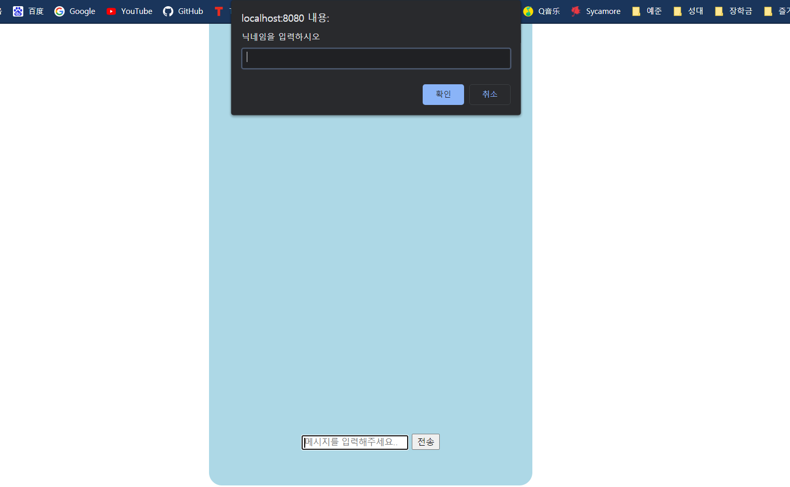

# OSS_FinalProject_EaTogether

## The Name of Our App
- EaTogether
- 'Eat'과 'Together'를 합하여 만들어진 이름으로 이 앱과 함께 무엇을 먹을지 고민하라는 의미와 이 앱을 통해 함께 식사를 할 사람을 구할 수 있다는 두가지 의미를 모두 갖고있습니다.

## Screenshots of App

## Link of Demo Video

## Installation Instructions
1. electron을 설치한다.
2. 프로그램(파일)들이 있는 디렉토리에 npm start로 electron을 활용해서 구동할 수 있다.
- 프로그램파일 및 electron설치-> 프로그램 파일이 있는 디렉토리에 npm install --save-dev electron 입력 -> npm start입력
3. 다른방법으로는 프로그램이 있는 디렉토리에서 node web.js를 입력해서 서버를 열고, 웹 페이지에서 local host:8080으로 접속할 수 있다.

## How to Use (Example)
1. 앱을 실행시키면 메인화면(사진1)에 6개 메뉴와 채팅으로 입장하는 버튼이 있다.
2. 한식 사진을 클릭하자 학교 주변의 한식 식당 네곳(사진2)이 표시된다.
3. 그 중에서 '청년밥상'을 클릭한다.
4. 그러자 식당의 위치가 지도(사진3)에 표시되고, 오른쪽 위의 리뷰버튼을 누르자 이 식당을 먼저 다녀간 사람들의 후기를 볼 수 있다(사진4).
5. 메인으로 버튼을 눌러 메인화면으로 돌아가고, 오른쪽의 채팅하기 버튼을 누른다.
6. 닉네임을 입력하는 창(사진5)이 표시되고, 다른 이와 채팅을 하며 함께 식당을 갈 사람을 찾아 약속을 잡는다(사진6).